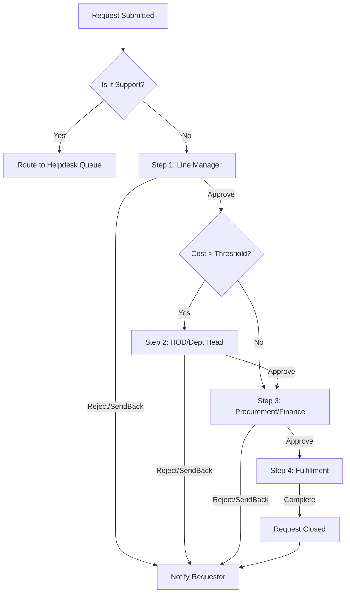

# Enterprise Request & Approval Workflow Engine - Technical Blueprint

## 1. System Architecture Overview
The system is designed as a decoupled Full-Stack application to ensure scalability and maintainability.

- **Frontend**: React.js with Tailwind CSS for a responsive, modern UI.
- **Backend**: Node.js with NestJS (TypeScript) for a structured, enterprise-grade API.
- **Database**: PostgreSQL for relational data integrity and complex querying of hierarchical structures.
- **Authentication**: Hybrid approach supporting JWT-based RBAC, CSV/Excel import for local users, and Active Directory (AD/LDAP) integration for SSO.
- **Notifications**: SMTP-based email service with HTML templates.

### High-Level Data Flow
`Requestor` $\rightarrow$ `Dynamic Form` $\rightarrow$ `Workflow Engine` $\rightarrow$ `Sequential Approvers` $\rightarrow$ `Fulfillment Agent` $\rightarrow$ `Requestor (Closed)`

---

## 2. Database Schema (ERD)

### Core Entities
- **`Users`**: Stores employee details and hierarchy.
  - `id` (UUID, PK), `full_name`, `email`, `department`, `manager_id` (FK $\rightarrow$ Users.id), `role_id` (FK $\rightarrow$ Roles.id), `external_id` (String, nullable - for AD/LDAP GUID), `auth_source` (Enum: Local, AD)
- **`Roles`**: System roles.
  - `id` (PK), `role_name` (Requestor, Approver, IT Agent, Admin Agent, Super Admin)
- **`Categories`**: Hierarchical request types.
  - `id` (PK), `name`, `parent_id` (FK $\rightarrow$ Categories.id, nullable), `is_active` (Boolean)
- **`Requests`**: The central request entity.
  - `id` (UUID, PK), `tracking_id` (String, Unique), `requestor_id` (FK $\rightarrow$ Users.id), `category_id` (FK $\rightarrow$ Categories.id), `status` (Enum: Pending, Approved, Rejected, SentBack, Fulfilled), `total_cost` (Decimal), `justification` (Text), `urgency` (Enum), `created_at`, `updated_at`
- **`RequestFields`**: Stores dynamic form data.
  - `id` (PK), `request_id` (FK $\rightarrow$ Requests.id), `field_key` (String), `field_value` (Text)
- **`RequestAttachments`**: Stores references to uploaded files/images.
  - `id` (PK), `request_id` (FK $\rightarrow$ Requests.id), `file_name` (String), `file_path` (String), `file_type` (String), `uploaded_at` (Timestamp)
- **`WorkflowSteps`**: Defines the approval chain per category.
  - `id` (PK), `category_id` (FK $\rightarrow$ Categories.id), `step_order` (Integer), `approver_role_id` (FK $\rightarrow$ Roles.id), `min_cost_threshold` (Decimal, nullable), `is_mandatory` (Boolean)
- **`ApprovalLogs`**: Immutable record of decisions.
  - `id` (PK), `request_id` (FK $\rightarrow$ Requests.id), `approver_id` (FK $\rightarrow$ Users.id), `action` (Enum: Approve, Reject, SendBack), `comments` (Text), `timestamp`
- **`AuditLogs`**: System-wide activity log.
  - `id` (PK), `user_id` (FK $\rightarrow$ Users.id), `action` (String), `entity_type` (String), `entity_id` (UUID), `timestamp`, `details` (JSONB)

---

## 3. Workflow Engine Logic

The engine operates as a **Sequential State Machine**.

### Approval Routing Logic
1. **Trigger**: Request is submitted.
2. **Lookup**: Fetch `WorkflowSteps` for the selected `category_id` ordered by `step_order`.
3. **Evaluation**:
   - For each step:
     - If `min_cost_threshold` is defined and `request.total_cost < threshold`, skip this step.
     - If `approver_role_id` is "Line Manager", target is `request.requestor.manager_id`.
     - If `approver_role_id` is a specific role (e.g., "Finance"), target is all users with that role.
4. **State Transition**:
   - **Approve**: Move to `step_order + 1`. If no more steps, set status to `Approved` and notify Fulfillment.
   - **Reject**: Set status to `Rejected`. Notify Requestor. End workflow.
   - **Send Back**: Set status to `SentBack`. Notify Requestor. Reset to Step 1 or previous step.

### Workflow Diagram

---

## 4. API Specification

### Authentication APIs
- `POST /api/auth/login` $\rightarrow$ Local login.
- `POST /api/auth/sso` $\rightarrow$ Active Directory / SSO authentication.

### Requestor APIs
- `POST /api/requests` $\rightarrow$ Submit a new request.
- `POST /api/requests/attachments` $\rightarrow$ Upload images/documents for a specific request.
- `GET /api/requests/my` $\rightarrow$ List requests submitted by the user.
- `GET /api/requests/:id` $\rightarrow$ Get detailed status and audit trail of a request.

### Approver APIs
- `GET /api/approvals/pending` $\rightarrow$ List requests awaiting current user's action.
- `POST /api/approvals/:id/action` $\rightarrow$ Submit action (`approve`, `reject`, `sendback`) with mandatory comments for non-approval.

### Admin APIs
- `POST /api/admin/users/import` $\rightarrow$ Bulk upload users via CSV.
- `PUT /api/admin/categories` $\rightarrow$ Update category hierarchy.
- `PUT /api/admin/workflows` $\rightarrow$ Map approval steps to categories.
- `GET /api/admin/audit-logs` $\rightarrow$ View system-wide audit trail.

---

## 5. Frontend Architecture

### Authentication UI
- **Login Page**: Toggle between Local Login and Corporate SSO (Active Directory).

### Requestor Wizard
- **Step 1: Category Selection**: Cascading dropdowns (Primary $\rightarrow$ Secondary).
- **Step 2: Dynamic Form**: Fields rendered based on `category_id`. Auto-populated user info.
- **Step 3: Review & Submit**: Summary page with a multi-file upload component for images, quotes, or screenshots.

### Approver Dashboard
- **Queue View**: Table of pending requests with urgency indicators.
- **Decision View**: Side-by-side view of request details and the approval action panel.

### Admin Portal
- **Category Manager**: Tree-view editor for categories.
- **Workflow Mapper**: Tabular interface to define `Step Order` $\rightarrow$ `Role` $\rightarrow$ `Threshold`.
- **User Management**: CSV upload interface and role assignment table.

---

## 6. Notification Matrix

| Event | Recipient | Template Content | Trigger |
|---|---|---|---|
| Submission | Requestor | Tracking ID, Summary, Estimated Timeline | `Request.create()` |
| Pending Action | Approver | Request Summary, Link to Action Portal | `Workflow.moveToStep()` |
| Status Change | Requestor | New Status (Approved/Rejected), Reason if applicable | `Request.updateStatus()` |
| Ready for Fulfillment | IT/Admin Agent | Final Approval secured, Provisioning details | `Workflow.finalApproval()` |
| Resolution | Requestor | Confirmation of fulfillment/closure | `Request.close()` |

---

## 7. Security & Compliance
- **RBAC & SSO**: Middleware to verify `user.role` before accessing `/api/admin/*` or `/api/approvals/*`. Integration with AD for seamless authentication and group-to-role mapping.
- **Data Integrity**: Use of database transactions for state transitions to prevent race conditions.
- **Audit Trail**: Every change to `Requests` or `ApprovalLogs` triggers an entry in `AuditLogs`.
- **Input Validation**: Strict Zod/Joi validation for all API payloads to prevent injection.

